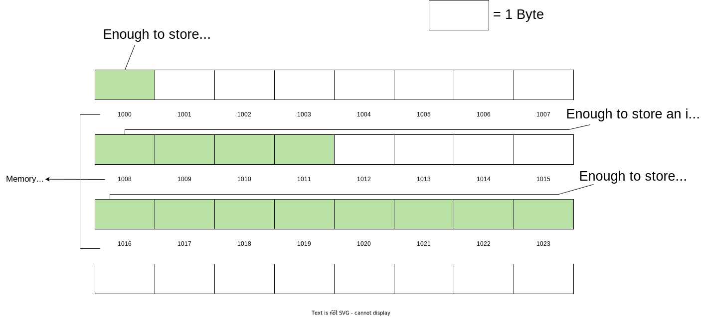
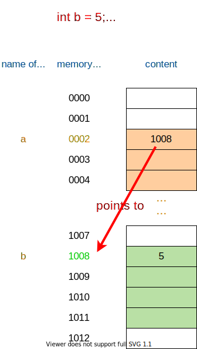

# Guide to Memory Management and Debugging in C

By Soura Mandal and Jonah Meggs

*DISCLAIMER: This guide is intended to provide a summary of some key concepts surrounding memory management in C, to help you gain some background and context, and help you debug memory errors in your program. This guide does not go into significant depth and simplifies some concepts for the sake of clarity, so links to further reading will be provided where necessary. This guide is also unofficial, and not directly affiliated with UNSW.*


# Contents

- [Introduction](#introduction)
  - [Pointers](#pointers)
  - [Arrays](#arrays)
  - [Variable Scope and Passing by Reference](#variable-scope-and-passing-by-reference)
  - [Some Context: Stack vs Heap Memory](#some-context-stack-vs-heap-memory)
  - [When should memory be dynamically allocated?](#when-should-memory-be-dynamically-allocated)

- [Memory Allocation and Management](#memory-allocation-and-management)
  - [Malloc](#malloc)
  - [Free](#free)
  - [Calloc](#calloc)
  - [Realloc](#realloc)
    - [How it works + Time Complexity](#how-it-works--time-complexity)
  - [Other Functions](#other-functions)
  - [Strings + String Literals](#strings--string-literals)
  - [Mallocing Structs](#mallocing-structs)
    - [Freeing a Struct](#freeing-a-struct)
  - [Mallocing a 2D Array](#mallocing-a-2d-array)
    - [Freeing a 2D Array](#freeing-a-2d-array)
    - [Mallocing an Array of Strings](#mallocing-an-array-of-strings)
  - [Complex Example - Creating a Student Housing Database in C](#complex-example---creating-a-student-housing-database-in-c)

- [Debugging Memory Errors](#debugging-memory-errors)
  - [Common Memory Errors](#common-memory-errors)


# Introduction

A good way to visualise memory is as a [contiguous](https://www.merriam-webster.com/dictionary/contiguous) sequence of bytes, each with their own memory address:



## Pointers

- If you have a variable `var` in your program, `&var` will give you the address that the variable is actually located at within your computer's memory.
- A pointer is a special type of variable that can store memory addresses.
- Pointers are declared using an asterisk following the data type - i.e. `int *ptr;` means that 'ptr' is a pointer to an integer (it stores the memory address of an integer)
- Pointers can be dereferenced to access the value located at that memory address. This is done by prepending an asterisk to the pointer variable.

It's important to note that pointers themselves (just like any other variable) take up some space in memory, and so have their own memory address. 

Consider the following example where the pointer **`a` points to (stores the memory address of) the variable `b`.**



```c
#include <stdio.h>
int main()
{
  int b = 5;
  printf("b: %d\n", b);
  printf("address of b: %p\n", &b);
  
  int *a = &b;
  printf("address stored in a: %p\n", a);
  printf("value retrieved after dereferencing a: %d\n", *a);

  printf("address of a: %p\n", &a);
  
  return 0;
}

output:
$ b: 5
$ address of b: 1008
$ address stored in a: 1008
$ value retrieved after dereferencing a: 5
$ address of a: 0002

// NOTE: In practice, a memory address is a hexadecimal number and is often much longer, something like '0x00001c088'*
```


> 💡 A good way to read pointer declarations is by reading them backwards - i.e. `int **g;` → `g * * int` → g is a pointer to a pointer to an integer


## Arrays

In memory, an array is just a contiguous sequence of bytes that is long enough to hold a specified number and type of element. For example, to declare an array `int nums[5];` which can hold 5 integers (which are each 4 bytes long), you would need ***5 x 4 = 20*** bytes of contiguous memory. 

- The green bytes represent the single block of contiguous memory, the blue brackets show how each integer would be positioned and stored in each slot/index of the array


There are some things to note here:

- The actual array variable itself - in this case, `nums` - is actually a pointer to the first element of the array (i.e. stores the address of the beginning of the contiguous block of memory)
- The array may just be a single contiguous block, but because this array is declared with type `int` (which is 4 bytes long), the square-bracket access notation will treat every 4 bytes starting from the beginning as one array element.
    - This is what allows the statement `nums[2]` to access the third element of the array - it starts from the beginning and moves in two 4-byte increments to reach the address of the third element.

## Variable Scope and Passing by Reference

When a variable is passed as an argument into a function, the function receives a *copy* of that variable that is *local to the function's scope*. This means that you can't modify the value of the original variable by directly passing it into a function. 

Instead, to be able to modify the value stored in the original variable, the function must receive a pointer to the variable - this is called **passing by reference**. This works because now the function has the address of the original variable - remember that a pointer is just a memory address.

```c
void addToInt(int num) {
  num += 1;
}

void addToIntByRef(int *num) {
  *num += 1;
}

int main() {
  int x = 5;
  addToInt(x); // only the VALUE stored inside x is passed into the function
  printf("after addToInt, x = %d\n", x);

  addToIntByRef(&x);
  printf("after addToIntByRef, x = %d\n", x);
}

Output:
$ after addToInt, x = 5
$ after addToIntByRef, x = 6
```

So we can dereference a pointer within a function and change the value at that address. 

**What about changing what a pointer itself points to?**

To do this, *a pointer to that pointer* must be passed as an argument to the function. Otherwise, the local copy of the pointer will be pointing to something different, but the original pointer will stay the same.

Consider the following example:


**Alternatively,** the pointer to change can be within a struct, and a pointer to this struct can be passed to the function to achieve the same goal. 

- This is the reason why trees and linked lists often have a `listRep` or `treeRep` struct which holds the `head` or `root` pointer - this structure allows those pointers to be changed by passing a pointer to the treeRep or listRep structure to the modifying function.

**What about modifying elements of an array by passing it into a function?**

Since an array itself is already a pointer to the start of a contiguous sequence of memory, **it can be passed directly into a function as an argument, and it's elements can be accessed and modified.**

Both of the following functions (which aim to set every element in an integer array to 3) are equivalent and valid:

```c
void makeAllThrees(int arr[], int length) {
  for (int i = 0; i < length; i++) {
    arr[i] = 3;
  }
}

void makeAllThrees(int* arr, int length) {
  for (int i = 0; i < length; i++) {
    arr[i] = 3;
  }
}
```

 

## Some Context: Stack vs Heap Memory

Your program’s memory is divided up into a number of different sections, usually arranged like so:


Working from the bottom (address 0x00000000) up:

- **Code** includes the machine code or instructions that define your program.
- **Data** includes any hardcoded data, for example strings that you define like `"Hello World!\n"`
- **Static** includes any global variables your program uses.
- The **heap** is a dynamic memory region, used by malloc/calloc/realloc. It grows towards the stack.
- The **stack** is another dynamic memory region, used by the OS for local variables. It grows towards the heap.


> 💡 A *stack overflow* is when the stack and the heap collide


We are mostly concerned with the two dynamic memory regions, the heap and the stack.

- **Stack memory** has a set of ordered operations for its work. It’s where relevant information about your program goes — which functions are called, what variables you created, and some more information. This memory is managed by the program/operating system and **not by the developer - you don't need to worry about allocating/freeing this memory.**
- **Heap memory** is often used to allocate memory whose size may need to change during runtime, which is supposed to exist as long as the developer wants. That said, **it’s the developer’s job to control the usage of the memory on the heap**. We call this Dynamic Memory.

You’re placing things on the heap every time you use `malloc`, `calloc`, `realloc` etc to allocate memory for something. 

Any other call that goes like `int i;` or `char str[100];` is placing that in stack memory.

- Because the program automatically manages stack memory, any variables allocated on the stack do not need to be manually freed.
- However, because the developer takes on the responsibility of any memory allocated on the heap, they **must manually free it** once it is done being used, otherwise **memory leaks** will occur.


> 📘 [**Source & Further Reading**](https://www.freecodecamp.org/news/understand-your-programs-memory-92431fa8c6b/)


## When should memory be dynamically allocated?

After memory is allocated for something in the stack, that memory cannot be resized. Hence, the size that is specified at compile time will be the maximum size of the memory for the duration of the program.

- For singular numerical variables (`int`*,* `char`, `double`*, etc*) stack memory is fine to use - there shouldn't be a need to change the type or size of a variable like this.
- Similarly, if the maximum size of an array is known, and you are certain that the array won't have to change size, declaring this using stack memory is fine as well:

```c
int i = 0;
double k = 6.54;
char letter = 'a';

// e.g. if the maximum length of a possible string will always be 10 
// characters, then allocating a character array like this is fine (one slot 
// extra for the terminating null '\0' character that ends the string):
char word[11]; 
```

However, you need to use dynamic memory when:

- You cannot determine the correct fixed size of memory to use at compile time,
- You need to resize the allocated memory during runtime,
- You want to build data structures without a fixed upper size (such as linked lists, trees, graphs etc),
- Or you want to allocate a *very* large object

For example, consider a program that reads words in from a text file and converts it into a linked list of words - you don't know how many words there are, nor do you know the length of the longest word at compile time. 

This is a situation where dynamic memory allocation is necessary - to allocate a new list node for each word read in, and to allocate a character array to store each word.


> 📘 [**Source and Further Reading**](https://stackoverflow.com/questions/18217525/why-or-when-do-you-need-to-dynamically-allocate-memory-in-c)

# Memory Allocation and Management

## Malloc

**The C library function `void *malloc(size_t size)` allocates a requested amount of memory in the heap, and returns a pointer to the start of that memory (or NULL if the memory cannot be allocated).** 

The general way to use malloc - for instance, to allocate enough memory for an array of 5 integers - is as follows:

```c
int *nums = malloc(5 * sizeof(int));
```

To understand this malloc call better, let's write it out in plain English:

> *Allocate a block of contiguous memory which is 5 times the size of an integer type (4 bytes). 
Return a pointer to the start of this memory, storing it in the integer pointer variable called 'nums'.*
> 

In memory, this array allocation can be visualised just like it was in the 'Arrays' section above. 

The main differences being that:

- Stack allocated arrays are declared with an integer between square brackets like `int nums[5];`, while a malloced array is defined as a pointer variable `int *nums = ...` . Remember that in both cases, `nums` is a pointer to the start of the contiguous memory
- The stack allocated array cannot be resized during runtime, while the malloced array can be resized using `realloc()` (more on this soon)

```c
// initialising all values to 0
for (int i = 0; i < 5; i++) {
  nums[i] = 0;
}
// accessing and modifying
nums[3] = 5;
printf("%d\n", nums[3]); // prints 5
```

Each call to `malloc()` is considered to be ***O(1)*** time complexity.


> 📘 [**Tutorialspoint Page**](https://www.tutorialspoint.com/c_standard_library/c_function_malloc.htm)

#### Returning an Array from a Function - Stack vs Heap Allocated

Only heap-allocated arrays (i.e. malloced arrays) can be validly returned from a function. Stack allocated arrays (i.e. using square-bracket notation) within a function are local to the function's scope, and will not be able to be used after returning.

```c
// invalid return 
int *return_stack_array() {
  int arr[10];
  for (int i = 0; i < 10; i++) {
    arr[i] = i;
  }
  return arr;
}

// valid return
int *return_heap_array() {
  int *arr = malloc(10 * sizeof(int));
  for (int i = 0; i < 10; i++) {
    arr[i] = i;
  }
  return arr;
}

int main() {
  int* arr_p;

  // undefined behaviour
  arr_p = return_stack_array();
  printf("%d\n", arr_p[9]);

  // correct
  arr_p = return_heap_array();
  printf("%d\n", arr_p[9]);
  free(arr_p);

  return 0;
}
```
> 📘[**Further Reading**](https://stackoverflow.com/questions/68522620/returning-an-array-from-function-in-c) 

## Free

**The C library function `void free(void *ptr)` deallocates the memory previously allocated by a call to calloc, malloc, or realloc.**

This is fairly straightforward - any memory that has been allocated on the heap must be freed properly, or memory leaks will occur. 

A good rule of thumb for this is that there **must be one `free` call for every `malloc/calloc` call in your program.** 

- For example, this means that **if you call `malloc/calloc` in a loop for 10 iterations, you must call `free` 10 times** for each of the variables that the allocated memory was assigned to.

Usage:

```c
int main() {
  int *nums = malloc(5 * sizeof(int));
  // doing something with the array, etc
  free(nums); // one malloc call, so one free call
}
```

> 📘 [**Tutorialspoint Page**](https://www.tutorialspoint.com/c_standard_library/c_function_free.htm)


## Calloc

**The C library function `void *calloc(size_t nitems, size_t size)` allocates a requested amount of memory in the heap, and returns a pointer to the start of that memory (or NULL if the memory cannot be allocated). It then initialises/sets all of the allocated memory to zero.**

This produces the same result as mallocing an array, and then iterating over it and setting every element to 0.

Usage:

```c
/*
In void *calloc(size_t nitems, size_t size):
  nitems − This is the number of elements to be allocated.
  size − This is the size of each element.
*/
int main() {
  int *nums = calloc(5, sizeof(int));

  // Which produces the same result as doing:
  int *nums = malloc(5 * sizeof(int));
  for (int i = 0; i < 5; i++) {
    nums[i] = 0;
  }
}
```

Using calloc to allocate memory for a struct containing primitive numeric types and pointers will ensure that all the numeric fields are set to 0 and all pointers are set to NULL.


> 📘 [**Tutorialspoint Page**](https://www.tutorialspoint.com/c_standard_library/c_function_calloc.htm)

## Realloc

**The C library function `void *realloc(void *ptr, size_t size)` attempts to resize the memory block pointed to by `ptr` that was previously allocated with a call to `malloc` or `calloc`. It returns a pointer to the newly allocated memory, or NULL if the request fails.**

As stated above, realloc is what allows dynamic memory to be resized at runtime. This cannot be done with stack allocated memory.

Usage:

```c
/*
In void *realloc(void *ptr, size_t size):
  ptr − This is the pointer to a memory block previously allocated with malloc, calloc or realloc to be reallocated.
  size − This is the new size for the memory block, in bytes.
*/
int main() {
  // the array currently has a length of 5
  int *nums = malloc(5 * sizeof(int));
  // after reallocing, it has a length of 10
  nums = realloc(nums, 10 * sizeof(int));
}

// NOTE: realloc() returns a pointer to the new memory,
// which is why 'nums = realloc(...' is needed
```

### How it works + Time Complexity

Realloc works by trying to extend the currently allocated memory in-place, by appending the next few adjacent bytes to the allocation. 

However, the bytes adjacent to the current memory may already be allocated by something else. 

- In this case, realloc has to allocate the specified size of memory in an entirely new location in memory, and then **copy over all the elements in the old location to the new location one by one**.


**Therefore, `realloc()` has a worst case time complexity of ***O(N)*****. 


> 📘 [**Tutorialspoint Page**](https://www.tutorialspoint.com/c_standard_library/c_function_realloc.htm)

> [**Source for O(N) Behaviour**](https://en.cppreference.com/w/c/memory/realloc)

## Other Functions

- **memset -** [https://www.tutorialspoint.com/c_standard_library/c_function_memset.htm](https://www.tutorialspoint.com/c_standard_library/c_function_memset.htm)
- **memcpy -** [https://www.tutorialspoint.com/c_standard_library/c_function_memcpy.htm](https://www.tutorialspoint.com/c_standard_library/c_function_memcpy.htm)
- **strcpy -** [https://www.tutorialspoint.com/c_standard_library/c_function_strcpy.htm](https://www.tutorialspoint.com/c_standard_library/c_function_strcpy.htm)
- **strdup -** [https://www.tutorialspoint.com/strdup-and-strdndup-in-c-cplusplus](https://www.tutorialspoint.com/strdup-and-strdndup-in-c-cplusplus)
- **strtok -** [https://www.tutorialspoint.com/c_standard_library/c_function_strtok.htm](https://www.tutorialspoint.com/c_standard_library/c_function_strtok.htm)

## Strings + String Literals

In C, a string is just an array of characters, terminated by a null character (`'\0'`).

**Stack Allocation**

```c
int main() {
  // stack allocation of a string (character array) that can hold 3 letters (one extra for the null character at the end)
  int n = 3;
  char word[n + 1];
  // storing the string "abc" as ['a', 'b', 'c', '\0']
  word[0] = 'a';
  word[1] = 'b';
  word[2] = 'c';
  word[3] = '\0';

  // some convenient ways to do the same thing as above are:
  char word[4] = "abc";
  // OR
  char word[4] = {'a', 'b', 'c', '\0'};
}
```

Each letter of the stack allocated string can be modified, but the string cannot be resized because it is not dynamically allocated. 

**String Literals**

A string literal is a constant **read-only** string, whose letters cannot be modified after it is declared. String literals live in the **data** section of memory. The string can only be passed as a function argument, or printed, or have it’s individual letters accessed. String literals are declared using a character pointer, and do not need manual memory allocation.

```c
int main() {
  char *word = "Hello World";
  
  // the following will work
  printf("%s\n", word);
  printf("%c\n", word[1]);
  
  // this won't work (will likely segfault)
  word[1] = 'b';
}
```

**Heap Allocation**

```c
int main() {
  int n = 3;
  // allocating memory for a string that can hold 3 letters (one extra for the null character at the end)
  char *word = malloc((n + 1) * sizeof(char));
  
  // unlike stack allocation, only the following will work here to store "abc"
  word[0] = 'a';
  word[1] = 'b';
  word[2] = 'c';
  word[3] = '\0';
  // OR
  strcpy(word, "abc");
  
  // this **is not correct,** it'll just make the pointer *word* point to a string literal 
  // and lose the reference to the malloced memory
  word = "abc";

  // remember to free the memory once it has been used
  free(word);
}
```

> 📘[**Further Reading**](https://www.codingame.com/playgrounds/14213/how-to-play-with-strings-in-c/what-is-a-string-in-c)

## Mallocing Structs

Allocating memory for a struct in C is often used for data structure nodes such as those in linked lists/trees/graphs.

```c
#define MAX_NAME 20

int main() {
  // declaring the struct type 'student', whose name is max 20 letters in length, has an age and id
  struct student {
    char name[MAX_NAME];
    int age;
    int id;
  };

  typedef struct student *Student; // defines that writing 'Student' is the same as writing 'struct student *'
  
  //stack allocated struct
  struct student s1 = {
    .age = 20,
    .id = 1
  };
  strcpy(s1.name, "John");

  // heap allocated struct
  // s2 is a pointer to a student struct
  Student s2 = malloc(sizeof(struct student));
  strcpy(s2->name, "Bob");  // s2->name is equivalent to doing (*s2).name
  s2->age = 20;
  s2->id = 1;

  // the following two are INCORRECT, because they are only initialising 
  // enough memory for POINTERS, not enough for the struct itself
  Student s3 = malloc(sizeof(Student));               // sizeof(pointer to the struct)
  Student s4 = malloc(sizeof(Student *));             // sizeof(pointer to the pointer to the struct)

  // the following is CORRECT, because s5 is a pointer to the student,
  // but the asterisk in front of it in 'sizeof(*s5)' dereferences the pointer
  // type to obtain the 'struct student' type
  Student s5 = malloc(sizeof(*s5));
}
```

In the above example, only the struct itself had to be malloced, because all the fields inside the struct were stack-allocated. 

However, **when a struct has fields inside which need to be heap allocated, the struct and each of those fields must be allocated separately:**

```c
int main() {

  struct student {
    char *name;
    int age;
    int id;
    double *course_marks; // an array of marks for each course the student has done
  };

  typedef struct student *Student;

  // first, allocating memory for the struct itself - this does not allocate memory for the 'name' and 'course_marks' fields
  Student s1 = malloc(sizeof(struct student));
  
  s1->age = 20;
  s1->id = 1;
  
  // allocating memory for the 'name' string before assigning a value to it
  int name_len = 4; 
  s1->name = malloc((name_len + 1) * sizeof(char));
  strcpy(s1->name, "John");

  // allocating memory for the 'course_marks' array before assigning a value to it
  int num_courses = 7; 
  s1->course_marks = malloc(num_courses * sizeof(int));
  s1->course_marks[0] = 96;
  s1->course_marks[1] = 87;
  ...
}
```

### Freeing a Struct

When freeing a struct, any dynamic memory allocated within that struct must be freed first, and then the struct itself must be freed.

```c
free(s1->name);
free(s1->course_marks);
free(s1);
```

## Mallocing a 2D Array

A 2D array can be treated as an array of arrays - that is, it is an array where each element contains a pointer to another array. Therefore, allocating memory for a 2D array involves **a single allocation of memory** for the array that will hold the other arrays, **then a for loop** to individually allocate multiple arrays.

For example, to allocate memory for a 4 rows x 6 columns array:

```c
// stack allocation
int main() {
  int arr2d[4][6];
}

// heap allocation
int main() {
  int nrows = 4;
  int ncols = 6;

  int **arr2d = malloc(nrows * sizeof(int *));
  for (int i = 0; i < nrows; i++) {
    arr2d[i] = malloc(ncols * sizeof(int));
  }

  // access 2D array elements using arr2d[row][col]
  arr2d[2][3] = 7;
  arr2d[0][4] = 42;
  arr2d[3][5] = 13;
}
```


NOTE: Pay attention to the differences between the *sizeof(...)* statements in the code above

### Freeing a 2D Array

Again, every `malloc/calloc` call must have a corresponding `free` call. In this case, the multiple integer arrays that were malloced in the *for* loop should first be freed, followed by the single array of pointers. 

- This can’t be done the other way around, because if the array of pointers is freed first, the references to the multiple integer arrays will be lost.

```c
for (int i = 0; i < nrows; i++) {
  free(arr2d[i]);
}
free(arr2d);
```

### Mallocing an Array of Strings

Since each string is an array of characters, mallocing an array of strings is similar to a 2D integer array.

For example, mallocing an array of strings that can hold 4 words, each with a max length of 5 characters

```c
int main() {
  int nwords = 4;
  int max_letters = 5;

  int **words = malloc(nwords * sizeof(char *));
  for (int i = 0; i < nwords; i++) {
    words[i] = malloc((max_letters + 1) * sizeof(char));
  }

  
  strcpy(words[0], "earth");
  strcpy(words[1], "air");
  strcpy(words[2], "fire");
}
```


## Complex Example - Creating a Student Housing Database in C

There are 3 floors with 4 apartment units each in a college apartment building. Each unit can house multiple students. 

We will be modelling this as a 2D array of linked lists of students. Each array index represents one apartment unit, and the linked list of students represents the students assigned to that unit:


Consider the student struct being defined as:

```c
struct student {
    char *name;
    int age;
    double *course_marks;
    struct student *next;
}

typedef struct student *Student; // writing 'Student' is the same as writing 'struct student *'
```

After looking at the given scenario, it can be seen that we need to malloc a few things:

- A 2D array of pointers to student structs
- A new student struct for each student that will be added to the list
    - *name* and *course_marks* arrays for each student struct

In scenarios like this, it is best to abstract repeated malloc calls into functions. This keeps things clean, prevents duplicate code, and allows for parameters to be passed in.

```c
Student NewStudent(char *name, int age, int num_courses);
Student **Create2DArray(int nrows, int ncols);
void ListAppend(Student list, Student new);
void FreeAllData(Student **units);

int main() {
  int num_floors = 3;
  int num_units = 4;
  
  // an array of arrays of pointers to student structs --> hence, Student ** (remember that 'Student' 
  // is the same as 'struct student *') 
  
  Student **units = Create2DArray(num_floors, num_units);
  
  ListAppend(units[0][1], NewStudent("John", 23, 3));
  ListAppend(units[0][1], NewStudent("Sarah", 21, 2));
  ListAppend(units[0][1], NewStudent("Bob", 18, 2));
  // ...
  ListAppend(units[2][3], NewStudent("Bart", 25, 2));
  // ... etc
}

Student **Create2DArray(int nrows, int ncols) {
  Student **arr2D = malloc(nrows * sizeof(Student *));
  for (int i = 0; i < nrows; i++) {
    arr2D[i] = malloc(ncols * sizeof(Student));
  }
  
  return arr2D;
}

// As mentioned in the *Mallocing Structs* section above: for each struct, 
// memory must be allocated for the struct itself, and then any dynamic fields within the struct.

Student NewStudent(char *name, int age, int num_courses) {
  Student stu = malloc(sizeof(struct student));

  int name_len = strlen(name);
  stu->name = malloc((name_len + 1) * sizeof(char));
  strcpy(stu->name, name);

  stu->age = age;
  stu->course_marks = malloc(num_courses * sizeof(double));
  stu->next = NULL;
  
  return stu;		
}
```

# Debugging Memory Errors

The primary tool used to debug memory errors is 'valgrind', a a programming tool for memory debugging, memory leak detection, and profiling.

The most common Valgrind command to run is:

```bash
valgrind --leak-check=full ./<program>
```

To be able to properly understand Valgrind output, check out the [official UNSW CSE guide](https://www.cse.unsw.edu.au/~learn/debugging/modules/valgrind/).

---
---

It is also highly recommended that you check out all the [official UNSW CSE debugging documentation](https://www.cse.unsw.edu.au/~learn/debugging/) - they contain extremely useful information on valgrind, gdb, as well as the general process of debugging.

---
---

## Common Memory Errors

[https://www.cprogramming.com/tutorial/memory_debugging_parallel_inspector.html](https://www.cprogramming.com/tutorial/memory_debugging_parallel_inspector.html)

**Invalid Memory Access / Invalid Write**

This error occurs when a read or write instruction references unallocated or deallocated memory (i.e. you try to access or modify something that has already been freed)

<details open>
<summary>Example</summary>
<br>

```c
char *str = malloc(25 * sizeof(char)); 
free(str);
// Invalid write to deallocated memory in heap
strcpy(str, "Hello World"); 
```

```c
$ ./valgrind --leak-check=full ./<program>

Invalid write of size 4
  at 0x10917E ...
```

</details>
<br>

**Memory leaks**

Memory leaks occur when memory is allocated but not released.  Enough leaks will eventually cause the application to run out of memory resulting in a premature termination.

<details open>
<summary>Example</summary>
<br>

```c
char *str = malloc(512 * sizeof(char));
return;
```

```c
$ ./valgrind --leak-check=full ./<program>

HEAP SUMMARY:
     in use at exit: 512 bytes in 1 blocks
     total heap usage: 1 allocs, 0 frees, 512 bytes allocated
 512 bytes in 1 blocks are definitely lost in loss record 1 of 1
    at 0x4843839: malloc (in /usr/libexec/valgrind/vgpreload_mem...)
    by 0x10915E: main (in /home/program)
...
LEAK SUMMARY:
  definitely lost: 512 bytes in 1 blocks
...
```

</details>
<br>

**Missing Allocation/Double Free**

Occurs when freeing memory which has already been freed.

<details open>
<summary>Example</summary>
<br>

```c
char* str = malloc(20 * sizeof(char)); 
free(str); 
free(str); // results in an invalid deallocation
```

```bash
$ ./<program>

free(): double free detected in tcache 2

$ ./valgrind --leak-check=full ./<program>

Invalid free() / delete / delete[] / realloc()
  at 0x484621F: ...
```

</details>
<br>

**Other Common Memory Errors**

- trying to modify read-only memory (e.g. string literals)
- attempting to access a field of a null pointer (e.g. curr->next when curr is NULL)
- neglecting to pass by reference
- mallocing only enough space for a pointer to a string/struct instead of the string/struct itself
- trying to write past the bounds of an array
- losing a reference to allocated memory so it cannot be freed
- accidentally doing pointer arithmetic when you meant to add to the dereferenced value
- forgetting to free a string allocated by strdup
- trying to strcpy but not enough space
- using strtok improperly
